(AI usage note: this writeup was written by hand with the exception of the graph labels.)
(Fun fact: this entire study cost me 0$, all of it was funded by my Claude Max subscription (also explains the dataset size).)
# The Case for Browser Agents
Browser agents are about to take center stage, yet most people reading this are likely going to miss it.
I assume my readers are highly technical so the right answer for when to use a browser agent essentially boils down to "As a last resort. If the MCP fails and the API fails and we can't build our own API for them then and only then should I use a browser agent."
To the non-technical non-SWE they often have no option but to use a browser agent.
Here is the logic behind this: https://www.linkedin.com/feed/update/urn:li:activity:7481285576047063041/
It is the non-technical consumer that will be adopting it en masse.

# Limits of Browser Agents
Browser agents in premise are fantastic until you kick one off, wait 60 seconds for it to begin, 10 seconds to scroll down, another 10 seconds to scroll again, and it finally clicks to navigate somewhere...
At which point you cancel the task and do it yourself.
Or you just leave it running hoping it does the right thing, come back 30 minutes later to find it failed, or worst case, it did the wrong thing and took actions you have to correct or cannot even revert.

The browser agent's failure modes can be destructured into the following:
1. Latency: it is too slow to maintain the user's attention
2. Efficiency: it takes several more turns than a human would, introducing risk of adverse effects in the state of the target system.  
3. Correctness: The browser agent may fail to complete the task.

I explored a series of methods to unilaterally improve across each of these axes against a clean room version of Claude in Chrome.
The expectation was that any naive method would be sufficient to improve across all three axes, this was not the case. But after several phases of experimentation, arm [6b](#6b-ocic-x-brave-x-dynamic-analysis-embedded-task-x-single-experiential-context) showcased that by distilling prior experience into a prompt-embedded recipe together with a warmed-up session the agent significantly beats the baseline across all three axes: **-16% latency, -26% turns per task, and +37% increase in accuracy**.

| Axis | Phase-1 baseline (mean of [1a](#1a-cinc-cinc-x-chrome), [1b](#1b-ocic-ch-ocic-x-chrome), [1c](#1c-ocic-br-ocic-x-brave)) | [6b](#6b-ocic-x-brave-x-dynamic-analysis-embedded-task-x-single-experiential-context) (warm-up + recipe) |
| :--- | :---: | :---: |
| Latency, per task | 2.06 min | **1.74 min** |
| Latency, 12-task suite | 24.8 min | **20.9 min** |
| Turns per task | 32.9 | **24.1** |
| Tasks passed (of 12) | 8 | **11** |

<em><b>Table 1.</b> The winning arm against the Phase-1 baseline, which is the average of the three baseline arms (1a, 1b, 1c). Task time and turns are run-only: preparation is excluded, the same slicing used in every chart below. Accuracy is the deterministically re-graded verdict (<a href="../analysis/accuracy_regrade.py">accuracy_regrade.py</a>). Per-arm source figures live in <a href="../analysis/capstone.json">capstone.json</a>.</em>

<em><b>Figure 1.</b> Every arm placed by turns (path length) and end-to-end latency. The dashed crosshair marks the Phase-1 baseline, the average of the three baseline arms (1a, 1b, 1c); anything in the shaded lower-left beats it on both axes at once. The winning method, 6b, sits farthest into that corner. Built by <a href="../analysis/build_scalar_intro.py">build_scalar_intro.py</a>.</em>

This is the story of this experimentation and discovery.

# Study setup

Throughout every single run of the study **the same underlying model was used: Claude Sonnet 5 at Medium effort** ([`tasks_manifest.json`](../tasks_manifest.json), [`runner.py`](../runner.py#L582-L608)). 

## Dataset
The study begins with the dataset.
The dataset used is a stratified subset sourced from the [REAL web-agent benchmark](../../REAL).
The REAL dataset consists of 112 tasks designed to run against 11 target sites.
The study focused on **2 sites, "dashdish" (DoorDash clone) and "zilloft" (Zillow clone)** on the basis that each had enough easy/medium and hard tasks to get a large enough sample size to both train and test on.
Each site with a total of 7 easy/medium tasks and 2 hard tasks.
Three medium tasks were randomly selected from each target site to build the train set.
**The remaining 12 composed the held-out test set** ([`tasks_manifest.json`](../tasks_manifest.json)).

Caveat 1:
Although REAL provides difficulty labels they were shown to be **anti-correlated where the baseline ([1c](#1c-ocic-br-ocic-x-brave)) passes 3/4 hard tasks only 2/5 medium tasks passed** ([`accuracy_corrected.json`](../analysis/accuracy_corrected.json)).

Caveat 2: **Some evaluations were not consistent between semantically equivalent LLM outputs** ([`accuracy_regrade.py`](../analysis/accuracy_regrade.py)).

Caveat 3: The 12th task's evaluation was ambiguous and I will argue that its label is incorrect.

The target sites store their state in the site's cache and each site must follow a specific configuration to set up the task. Then an actor runs against the site. Finally the state of the site is captured and then scored against REAL's evaluation script. ([`seed`](../harness.py#L117-L135), [`finish`](../harness.py#L136-L181), [`eval`](../harness.py#L209-L244), [`WebCloneEvaluator`](../../REAL/src/agisdk/REAL/browsergym/webclones/evaluate.py))

## Factors
For each arm of the study, we phased in different factors and measured their impact across the three axes.
Each factor is defined as follows and is accompanied by a pictorial metaphor to help illustrate the concept.

### Harness
The key factor from which this whole study is built is the harness.
The harness has 2 levels: the official closed source Anthropic harness Claude in Chrome (CinC) and an augmented clean room version aptly named [open-claude-in-chrome](../../README.md) (OCIC).
Why make a clean room version? Three reasons:
1. Claude in Chrome controls which sites you have access to, this significantly limits the degrees of freedom of Claude resulting in people building unnecessary companies from this limitation. ([blocked list](../../README.md#blocked-domains-in-the-official-extension))
2. Claude in Chrome limits the extension to only work on Chrome and Edge, if you use a different browser you are out of luck.
3. Claude in Chrome harness uses several methods that slow down the agent and may decrease performance in other axes, that is completely out of the user's control.

OCIC solves each of these problems in turn expanding utility and improving performance by design, resulting in a substantial improvement where in **the average harness turn latency [1a](#1a-cinc-cinc-x-chrome) (CinC x Chrome) is 0.308s while in [1b](#1b-ocic-ch-ocic-x-chrome) (OCIC x Chrome) latency drops to 0.115s** ([`build_latency_harness.py`](../analysis/build_latency_harness.py), [`capstone.json`](../analysis/capstone.json)).

There is only a single arm that uses CinC, it serves as the control group for the study.

<em><b>Figure 2.</b> The harness is represented by the branding on the character's forehead.</em>

### Browser
The browser is the substrate within which the agent operates, similar to the harness, this contains two levels: Chrome and Brave.

There are only two arms that use the Chrome browser, the rest use Brave.

<em><b>Figure 3.</b> This factor is represented as the table the student does their work on.</em>

### Context Load
This factor is tremendously influential with empirical evidence showcasing **+1.92s per 100k tokens added to context every turn** ([`capstone.json`](../analysis/capstone.json)). Context load represents the amount of context already loaded into the Claude run session (chat history) in an arm before the task is kicked off.

 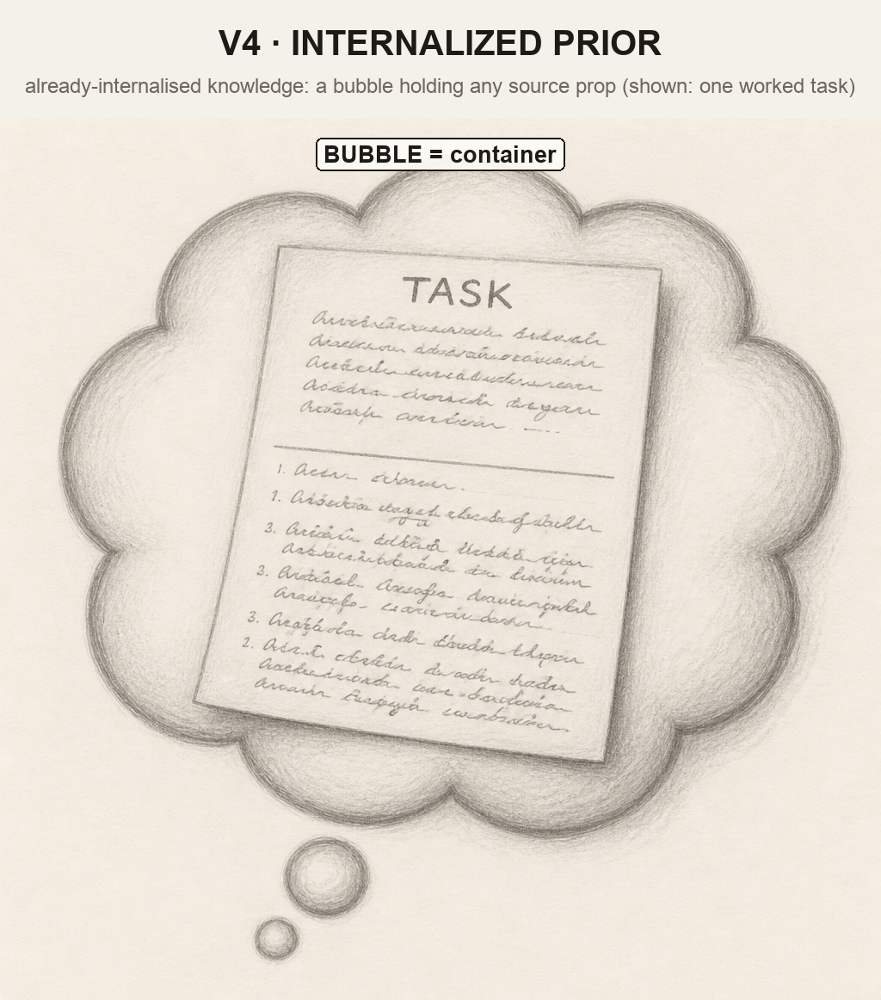

<em><b>Figure 4.</b> The context load is represented by the apparent tiredness of the student and a thought bubble. This representation is more direct than many of the other factors as they have a monotonic relationship. If you study more hours and you are tired you are likely to perform worse; if you load more context in the session the inference latency will increase. The thought bubble accompanies the tiredness to visualize the internalized material that was loaded into the context.</em>

### Source
The source represents the kind of trajectory format. In our case we have two levels: **self generated and expert demonstrations**.
Self generated or experiential trajectory represents the agent's own attempts at solving the train set of tasks ([`build_experiential_env.py`](../build_experiential_env.py)).
Expert demonstrations are captured via a new feature to OCIC in session recordings ([`extension/recorder/`](../../extension/recorder)). **These recordings capture several types of data simultaneously including: behavioral actions, cognitive transcripts, and cursor movements** ([schema](../../extension/recorder/SCHEMA_v0.md)).

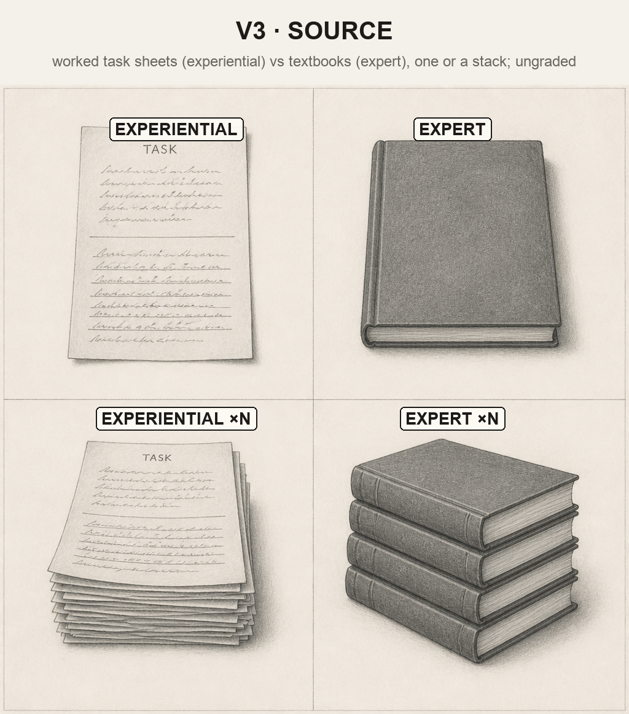

<em><b>Figure 5.</b> The experiential is represented by completed tasks showcasing the agent's prior attempts at solving similar problems. Alternatively the expert demonstrations are represented as a book illustrating an expert's recollection of their attempts at solving similar problems.</em>

### Compression Delivery
In some instances we perform an analysis of the sources in essence compressing them. The compression is then delivered in two ways. **First as an independent document added to the workspace**. **Second is as an artifact appended to the task prompt** ([`load_recipe`](../runner.py#L376-L381)).

<em><b>Figure 6.</b> The compression is represented either by an analysis document oftentimes sitting atop the source material or as a box inside the task paper, an analog to reference material for an exam.</em>

## Study Arms
The study is motivated by personal experience building methods to drive better performance in browser agents.
I never formally studied the impact of these methods, instead I relied on intuition.
**The study is designed to investigate the impact of each of these methods in a controlled manner while ablating through levels to discover the atomic impact of each factor in the method.** ([`EXPERIMENTS`](../runner.py#L383-L524))

### Phase 1: Baseline
Baseline assessing the performance of the two harnesses.

#### 1a (CinC): CinC x Chrome
Claude in Chrome running in the stock Chrome Browser.

#### 1b (OCIC-Ch): OCIC x Chrome
OCIC running in the stock Chrome Browser.

#### 1c (OCIC-Br): OCIC x Brave
OCIC running in the Brave Browser.

### Phase 2: Sources in Workspace
Phase 2 is driven by the hypothesis that **giving the agent access to similar trajectories in its workspace will drive better performance contingent on the agent seeking relevant information via agentic search** ([`populate_experience`](../runner.py#L534-L551)).

#### 2a: OCIC x Brave x Experiential (workspace)
OCIC running in the Brave Browser with prior experience trajectories in its workspace (plus a readme for context on what exists in the workspace).

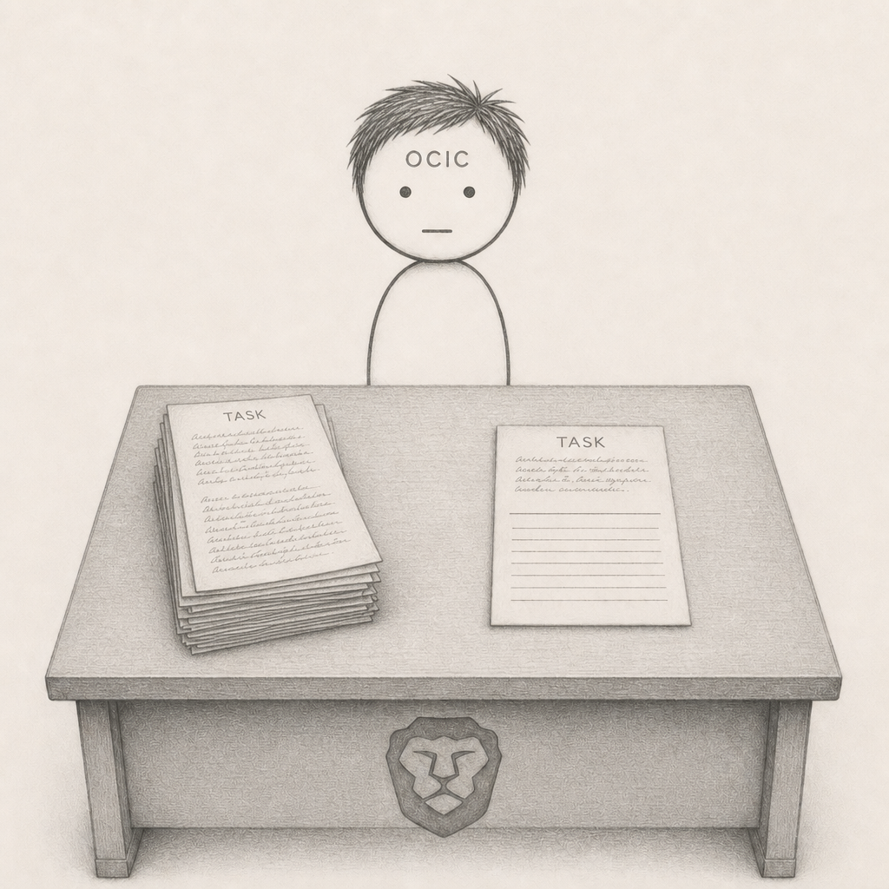

#### 2b: OCIC x Brave x Expert (workspace)
OCIC running in the Brave Browser with prior expert trajectories in its workspace (plus a readme for context on what exists in the workspace).

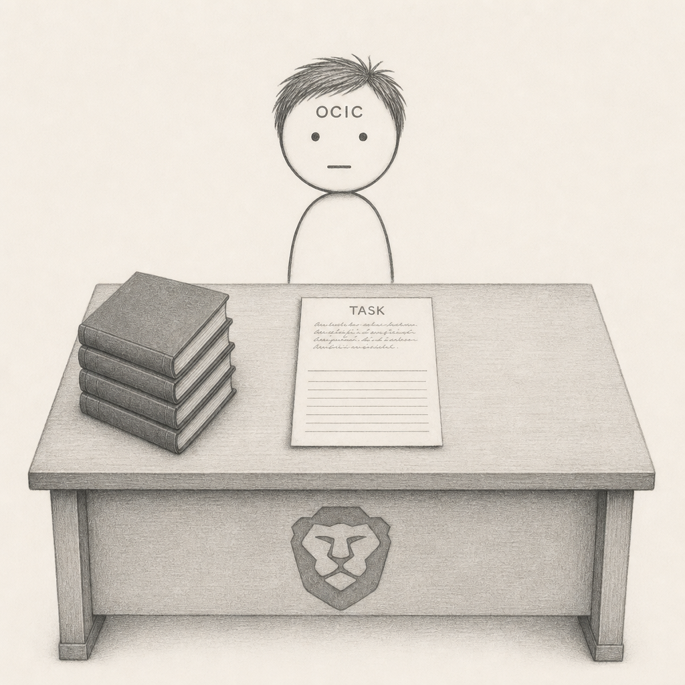

### Phase 3: Analyzed Workspace Sources
Following up on the discovery of the reduced performance of phase 2 I hypothesized that **providing an analysis of the sources would reduce the lookup time needed to build a model of the sites**. Phase 3 is designed to test this hypothesis.

#### 3a: OCIC x Brave x Experiential (workspace) x Analysis Docs
OCIC running in the Brave Browser with prior experience trajectories in its workspace and an analysis document grounded on the prior sources already in the workspace (plus a readme for context on what exists in the workspace).

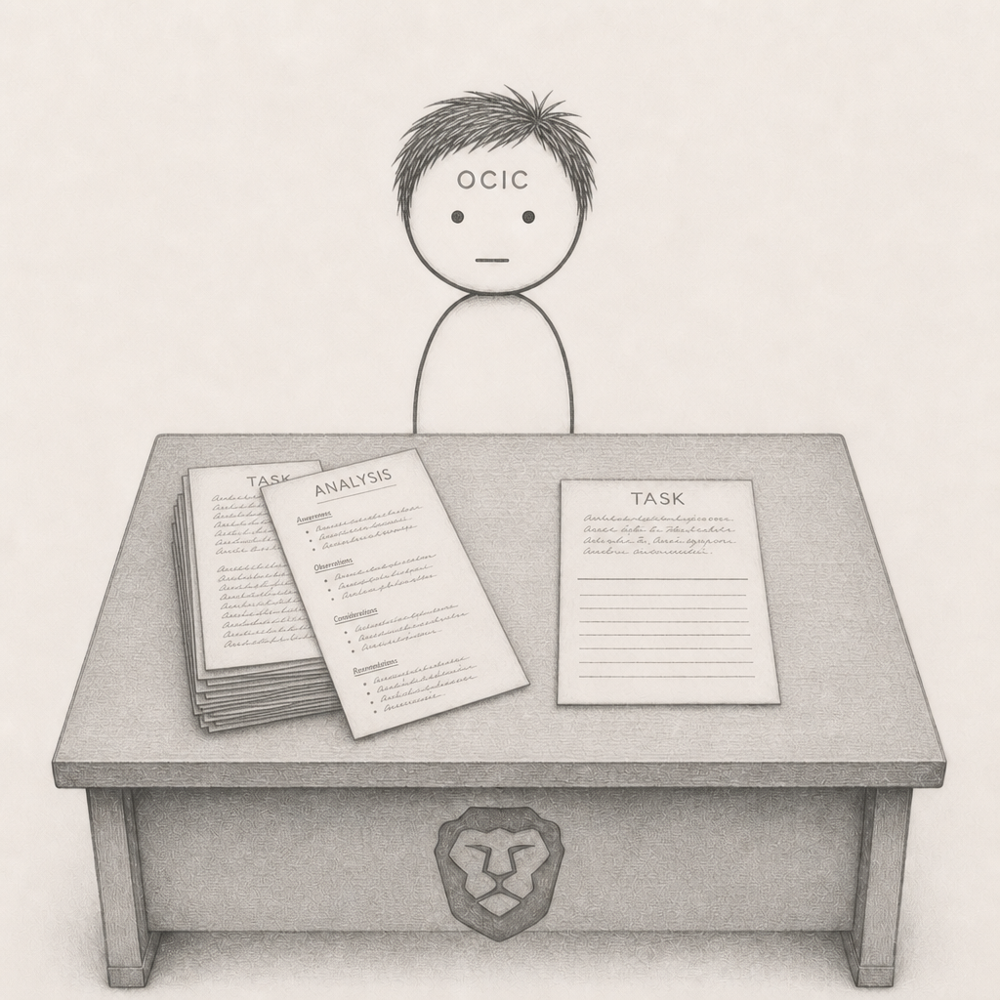

#### 3b: OCIC x Brave x Expert (workspace) x Analysis Docs
OCIC running in the Brave Browser with prior expert demonstrations in its workspace and an analysis document grounded on the prior sources already in the workspace (plus a readme for context on what exists in the workspace).

### Phase 4: Context Loaded. Forks.
Building off the poor performance of phase 3 I learned that **for the current difficulty of tasks the cost of agentic search would not pay off**. I hypothesized that instead of having the agent search through its workspace for priors you could **naively reap the benefits of prior experience by loading the priors directly into context before running the task** ([`runner.py`](../runner.py#L979)). 

#### 4a: OCIC x Brave x Experiential (context)
OCIC running in the Brave Browser with prior experience trajectories loaded into context naively by continuing the Claude session.

#### 4b: OCIC x Brave x Expert (context)
OCIC running in the Brave Browser with prior expert demonstrations internalized ahead of the task by performing a deep analysis of the expert demonstrations. Unlike [4a](#4a-ocic-x-brave-x-experiential-context) there is no means of loading the context naively so instead the agent internalized the context by operating on a workspace that contains the expert demonstrations. Over the course of internalizing the content the agent wrote notes onto disk which we represent as analysis documents.

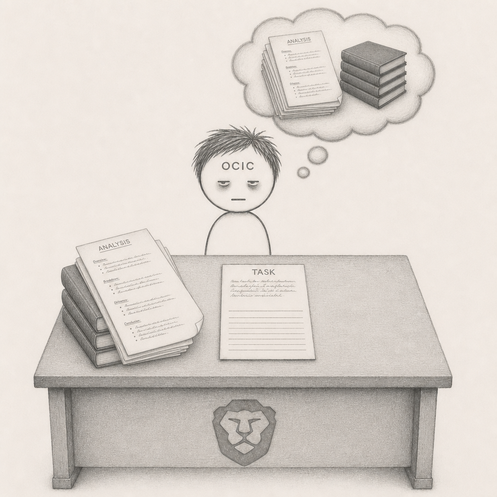

### Phase 5: Prompt Embedded Analysis 
Phase 4 reminded me of a mechanic of LLMs where put simply more context results in higher latency. Drawing from that and prior phases I hypothesized that **if the content of the experiences is distilled and embedded into the task prompt then the agent can reap the benefits of prior experience without the cost of agentic search nor the buildup of context**.
For both arms of this phase the analysis artifacts are constructed by distilling both 6 expert demonstrations and 6 experience trajectories ([generation prompt](../6b_reproduction/recipe_generation_prompt.md)).

#### 5a: OCIC x Brave x Single Analysis Embedded Task
OCIC running in the Brave Browser with a single analysis artifact embedded into the task prompt. 

#### 5b: OCIC x Brave x Dynamic Analysis Embedded Task
OCIC running in the Brave Browser. Two artifacts are constructed from an analysis against the sources each focused on one site. The task prompt is paired with the corresponding artifact for the site.

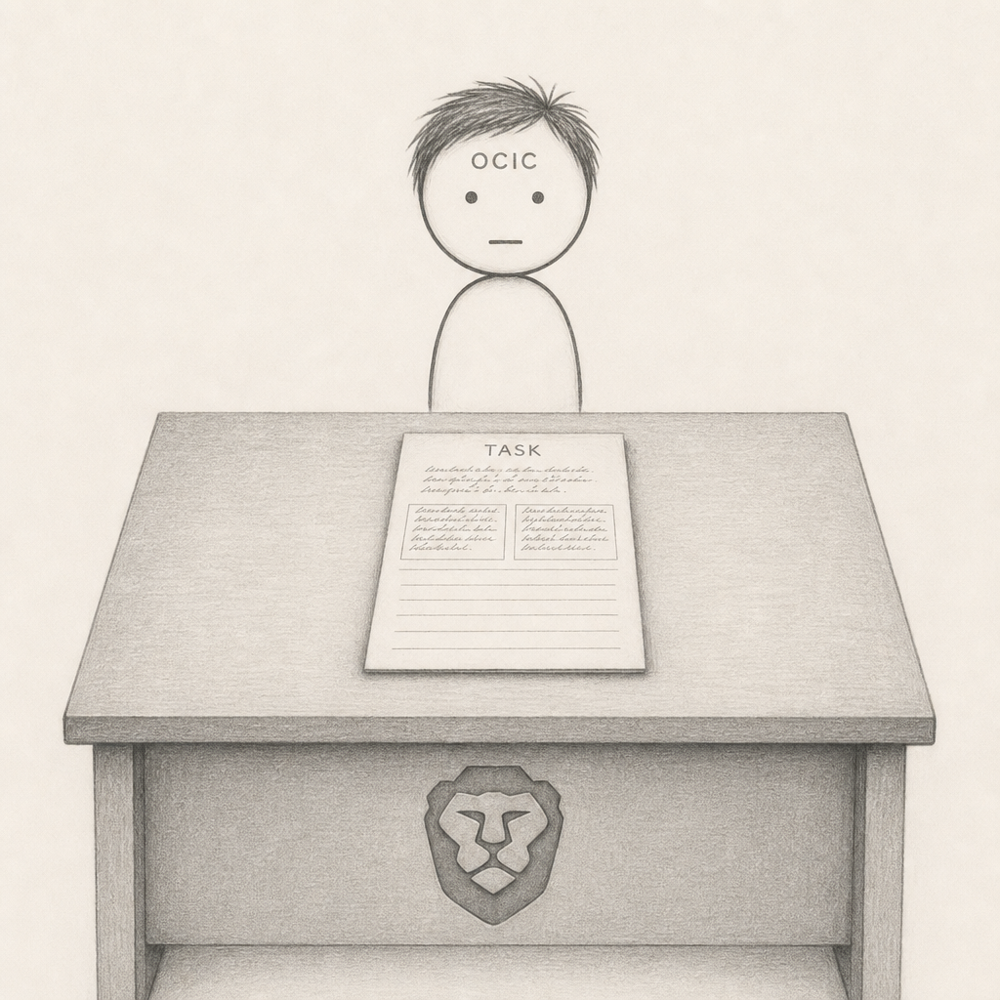

### Phase 6: Warm-up Context Loaded
After finally seeing phase 5 improve on the baseline I wanted to explore if you could get any benefits from an experiential warm-up (my intuition was stubborn on this). The hypothesis was that **by loading in a prior task into the session the agent would improve its performance** ([6b reproduction](../6b_reproduction/README.md)).

#### 6a: OCIC x Brave x Single Experiential (context)
OCIC running in the Brave Browser with a single prior experience trajectory loaded into context naively by continuing the Claude session.

#### 6b: OCIC x Brave x Dynamic Analysis Embedded Task x Single Experiential (context)
OCIC running in the Brave Browser with two site-specific analysis artifacts (one per site, paired with the matching task's site) embedded into the task prompt, and a single prior experience trajectory loaded into context naively by continuing the Claude session.

### Phase 7 (Corroloary): OCIC Recordings vs Anthropic Recordings (Expert Demonstrations)
So far the expert demonstrations have been produced by OCIC, but given Anthropic's recent release of [recordings in Claude Cowork](https://x.com/claudeai/status/2079595988998554047) I wanted to compare the two methods.
There is one key caveat to keep in mind in that **Anthropic's recordings are general purpose, recording at the OS level while OCIC's recordings are specifically for browser use**.
As for the Claude in Chrome recordings feature, **I selected not to use it given its poor implementation with skill truncation**.

#### 7a: OCIC x Brave x OCIC Expert (workspace) x Analysis Docs
Same setup as [3b](#3b-ocic-x-brave-x-expert-workspace-x-analysis-docs) just **different content for the recordings, important for parity with the Claude Cowork recordings** ([sources and artifacts](../phase7_reproduction/README.md)).

#### 7b: OCIC x Brave x Claude Cowork Expert (workspace) x Analysis Docs
Same setup as [3b](#3b-ocic-x-brave-x-expert-workspace-x-analysis-docs) just different content for the recordings and **differnet method for capturing the recordings** (Claude Cowork Recording feature; the six artifacts are in [`sources_cowork/`](../phase7_reproduction/sources_cowork)).

#### 7c: OCIC x Brave x OCIC Recordings Only sourced Dynamic Analysis Embedded Task 
Same setup as [5b](#5b-ocic-x-brave-x-dynamic-analysis-embedded-task) but instead of using the both experiential and expert demonstrations **only the new set of 6 OCIC recordings was used for the analysis artifacts** ([recipe](../phase7_reproduction/distilled/ocic_RECIPE_dashdish.md)).

#### 7d: OCIC x Brave x Claude Cowork Recordings Only sourced Dynamic Analysis Embedded Task
Same setup as [5b](#5b-ocic-x-brave-x-dynamic-analysis-embedded-task) but instead of using the both experiential and expert demonstrations **only the new set of 6 Claude Cowork recordings was used for the analysis artifacts** ([recipe](../phase7_reproduction/distilled/cowork_RECIPE_dashdish.md)).

# Results
There were 3 major axes we are measuring against: latency, turns per task, and correctness.

## Accuracy
Accuracy suffered from two limitations:
1. The dataset was not challenging enough to test anything meaningfully as it was quickly saturated from the baseline.
2. The evals were not consistent between semantically equivalent LLM outputs.

That being said **accuracy is a good control to ensure the agent would not regress**.

<em><b>Figure 7.</b> Tasks passed on the held-out test set (of 12), deterministically re-graded against ground truth. Nine of twelve tasks pass or fail identically across every arm; the three that vary (zilloft-2, zilloft-5, zilloft-10) were re-scored against the rubric's stated correct count after the LLM-judge grader was found to disagree with itself on identical answers. Built by <a href="../analysis/build_accuracy_arm.py">build_accuracy_arm.py</a> from <a href="../analysis/accuracy_corrected.json">accuracy_corrected.json</a>.</em>

An important thing to observe is that **accuracy across each of the phase 1 baseline arms is identical, scoring the exact same 8/12 with the exact same failed tasks** ([`accuracy_corrected.json`](../analysis/accuracy_corrected.json)).
This is the expected behavior as the LLM since the intelligence of the model is the same across all arms and the harness' semantic layer is not adversely influencing that intelligence.

The results indicate that within phases the results are fairly varied but **if you group by source you can see a clear trend**.

<em><b>Figure 8.</b> Tasks passed of 12, re-graded data, paired by phase. In phases 2, 3, and 4 the only factor that changes between the two bars is the source (experiential vs expert); the delivery mechanism (raw mount, +analysis, forked) is held fixed within each pair. Built by <a href="../analysis/build_accuracy_source.py">build_accuracy_source.py</a>.</em>

**This 1.7 average increase in accuracy is attributed specifically to a single type of task in zilloft where the page would not respond to a change in filters** (zilloft-2, zilloft-5, zilloft-10 — [`tasks_manifest.json`](../tasks_manifest.json)).
This type of issue is easier for a human to observe due to our continuous stream of visual input, but for an agent with discrete inputs it is a lot harder.
As a consequence the agent is inclined to take the inputs at face value knowing that it does not have the means to validate page responsiveness.

So how did the expert demonstrations help in resolving this issue?
I obviously did not change the harness nor the nature of a turn-taking agent, so the answer lies in something much simpler but subtle.
By demonstrating an inclination to check and observe outcomes, **I embedded a behavioral pattern of validation into the expert demonstrations**.
Here is a quote from the expert demonstrations:
> "I can see that there's zero delivery fee on the first, second, third, fourth, and fifth, suggesting that there is probably delivery, but **I'm just going to double check.**"

and again

> "Well, first, **I just want to double check**. So the home... The phone looks good. The payment detail looks good."

**This pattern was then picked up by the agent and followed in its execution of test tasks.**
The agent would verify that the page responded to the input by keeping watch for unresponsive states.

I would resist the urge to discredit this as happenstance, in part due to the fact that I never intended to teach the agent this (but will do so in the future 😁), but also because this is the nuance of expert demonstrations. As humans we know what to expect and what to look out for in these tasks and have prior experience navigating sites that is more often than not never written down or captured in a dataset.

**This demonstrates an emergent behavioral transfer worth researching in future work.**

## Turn-count
While accuracy is a coarse binary measure of correctness, turn-count can serve as a higher resolution measure of correctness.
This hinges on the assertion neatly represented by the discount factor in reinforcement learning, immediate rewards are better than future rewards.
**In short the fewer turns an agent takes towards a goal the more correct it is.**
Analysing turn count surfaces more nuanced insights than we could gather from accuracy alone.

Turn count is parsed from the detached Claude Code run `num_turns` output ([`runner.py`](../runner.py#L1054)). Generally it consists of a sequence of observe then think then act but it can vary.

The overall performance relative to the baseline average is shown below in Figure 9.

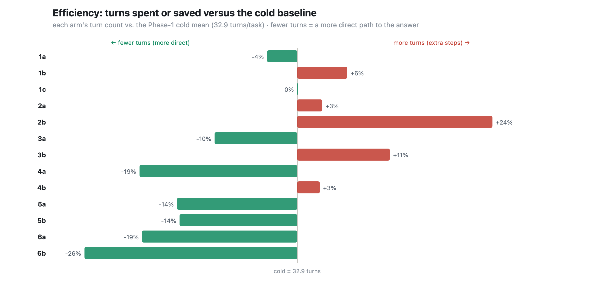

<em><b>Figure 9.</b> Each arm's mean turns per task against the Phase-1 cold baseline (32.9 turns/task, the average of 1a/1b/1c). Green bars ran shorter than cold; red bars ran longer. Arms ordered 1a&rarr;6b, matching Figures 10 and 11. The dashed outline on 3a marks what its bar would be excluding one catastrophic task (zilloft-10); see the discussion under Figure 10 for why. Built by <a href="../analysis/build_turns_delta.py">build_turns_delta.py</a>.</em>

The earlier methods of mounting prior experience into the workspace (phases 2 and 3) will require more turns to understand their workspace, which explains their performance. But by isolating for tool calls and separating them between browser use (CinC or OCIC) we can see a clearer picture in Figure 10.

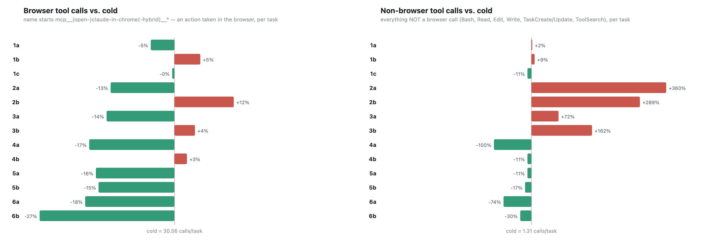

<em><b>Figure 10.</b> Every tool call in each rollout, split by a strict name-prefix match and shown as percent versus its own cold baseline. Left: browser tool calls, any call whose name starts mcp__(open-)claude-in-chrome(-hybrid)__* &mdash; an action taken in the browser. Right: non-browser tool calls, the reject set, every call that is NOT a browser call (Bash, Read, Edit, Write, TaskCreate/Update, ToolSearch). Counts are sliced to start at the last task prompt in the session, so prep-phase activity (4a's forked prior session, 4b's live study session) is excluded the same way prep time is excluded from task time in Figure 13. The dashed outline on 3a's browser-call bar marks what it would be excluding the same catastrophic task noted in Figure 9; non-browser calls barely move once that task is dropped, so only the browser panel is annotated. Built by <a href="../analysis/build_toolcalls_delta.py">build_toolcalls_delta.py</a> from <a href="../analysis/toolcalls.json">toolcalls.json</a>.</em>

Now that we have isolated for browser tool calls we can assess the stated granular accuracy more directly.
**The data supports the assessment that the validation behavior is driving an increase in turn count.**

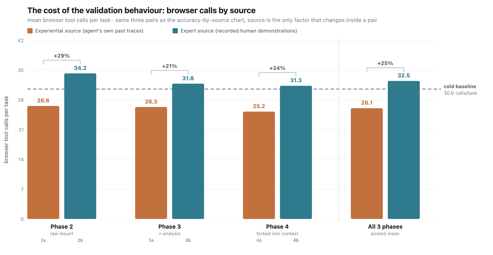

<em><b>Figure 11.</b> Mean browser tool calls per task, pairing each phase's experiential arm against its expert-sourced counterpart — the same three pairs as Figure 8, where source is the only factor that changes inside a pair. The expert arms run <b>21&ndash;29% more browser calls than their experiential twin</b> in every pair, and they are the only arms outside phase 1 that sit above the cold line at all: that gap is what validation costs. Built by <a href="../analysis/build_validation_toolcalls.py">build_validation_toolcalls.py</a> from <a href="../analysis/toolcalls.json">toolcalls.json</a>.</em>

Excluding the expert legs ([2b](#2b-ocic-x-brave-x-expert-workspace), [3b](#3b-ocic-x-brave-x-expert-workspace-x-analysis-docs), [4b](#4b-ocic-x-brave-x-expert-context)) the data shows an improvement in browser tool calls over the baseline phase across all arms.
**The trend showcases that most methods will drive an improvement in browser tool use count.**
In fact even in the expert demonstrations legs you can see, across phases, the browser tool use count decreases in accordance to their experiential counterparts.
Even with the validation behavior the turn improvements are trending toward improving on the baseline.

There is also another interesting trend when you observe the turn saving with respect to the task length. **The task savings are proportional to the task length.**

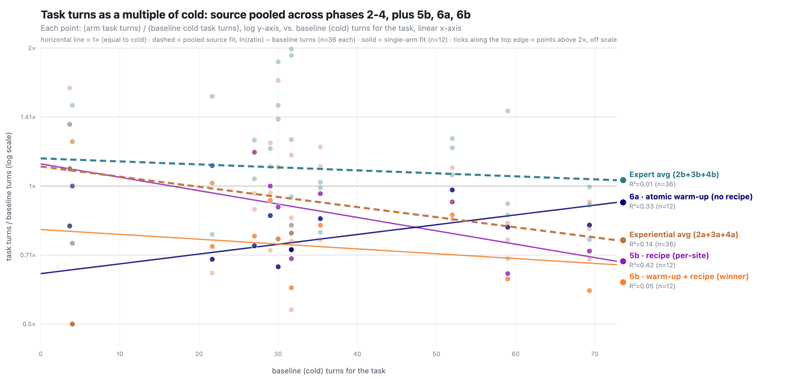

<em><b>Figure 12.</b> Each arm's own task turns divided by baseline (cold) task turns for the same task, plotted against baseline (cold) turns. Horizontal line is 1&times; (equal to cold). Dashed = pooled source fit, ln(ratio) &#126; baseline turns (experiential: 2a+3a+4a, expert: 2b+3b+4b, n=36 each); solid = single-arm fit (5b, 6a, 6b, n=12). Ticks along the top edge mark points above 2&times;, off scale. Built by <a href="../analysis/build_turns_ratio_decay.py">build_turns_ratio_decay.py</a>.</em>

As you can see in Figure 12 the y axis is set as a multiple of the baseline on every task.
That means that the trend illustrated by the best fit line (caveat: which is operating on very little data) showcases at the very least a flat line. **This suggests that the task savings are proportional to the task length.**

## Latency
Finally we assess the metric that inspired this whole study, latency.
Latency is measured simply by the total time spent by the `claude -p ...` process on the task ([`claude_json`](../runner.py#L582-L608)).
**Latency as with any task is an essential metric whose quantitative improvements have a qualitative impact on user experience, possibly enabling new workflows and use cases.**

(While latency per token generated is a function of the length of the context, I will not be discounting it as it is a reality to be contended with.)

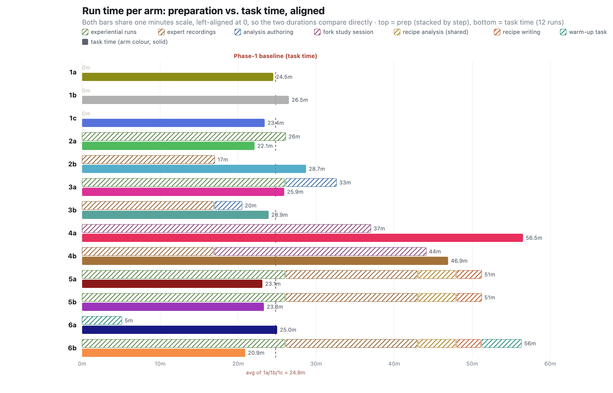

<em><b>Figure 13.</b> Two rows per arm on one shared minutes scale, both left-aligned at 0: top is preparation time (stacked by step type, coloured by step), bottom is task time (the 12-run suite, arm colour). Aligned rather than stacked end-to-end, so prep duration and task duration compare directly instead of one offsetting the other. Built by <a href="../analysis/build_runtime_arm.py">build_runtime_arm.py</a>.</em>

When it comes to latency we can see that **the performance is entirely in the details of the implementation**.
**The key factor that did showcase consistent improvements against the baseline was appending analysis artifacts into the task prompt.**
The influence is primarily observed in the wall-to-wall latency of [6b](#6b-ocic-x-brave-x-dynamic-analysis-embedded-task-x-single-experiential-context) at -16% but then marginally in [5a](#5a-ocic-x-brave-x-single-analysis-embedded-task) and [5b](#5b-ocic-x-brave-x-dynamic-analysis-embedded-task).

Similar to the multiplier analysis of turn count in Figure 12, below in Figure 14 is an analysis of the task time as a multiple of the baseline task time.

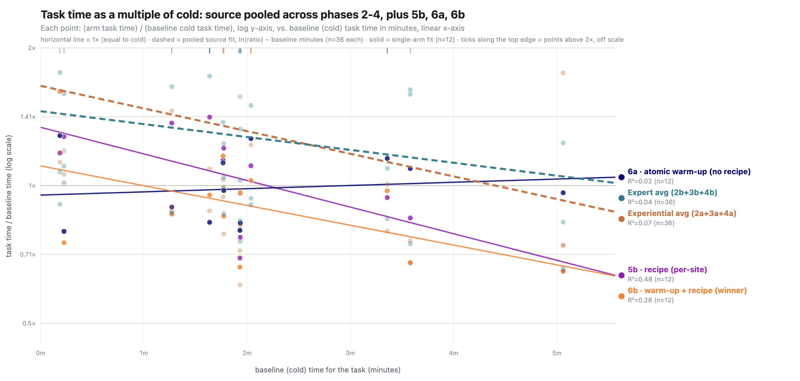

<em><b>Figure 14.</b> Each arm's own task time divided by baseline (cold) task time for the same task, plotted against baseline (cold) task time in minutes (average of 1a/1b/1c). Horizontal line is 1&times; (equal to cold). Dashed = pooled source fit, ln(ratio) &#126; baseline minutes (experiential: 2a+3a+4a, expert: 2b+3b+4b, n=36 each); solid = single-arm fit (5b, 6a, 6b, n=12). Ticks along the top edge mark points above 2&times;, off scale. Built by <a href="../analysis/build_ratio_decay.py">build_ratio_decay.py</a>.</em>

As observed in latency the slope is pronounced in this case. Latency not only improves with task length **but also compounds with the aformentioned decrease in number of turns**.

Latency from this system can be attributed to two parts: model inference and harness overhead. Harness overhead, the program execution and the network round-trips a tool call makes through the harness ([architecture](../../README.md#architecture)), is a marginal contributor to per-turn latency (screenshots aside, where render cost can be significant). **The harness overhead generally accounts for 0.1 - 0.3 of a 3.2 - 11.6 second turn. The dominant contributor is model inference itself.**

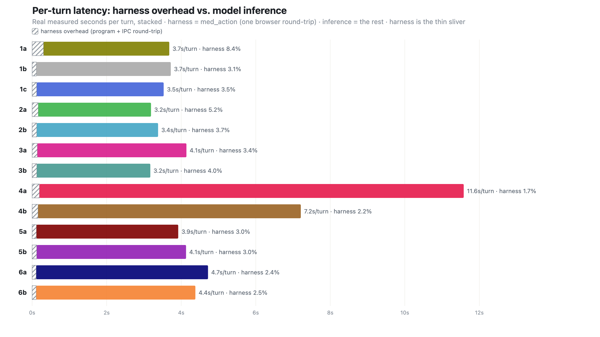

<em><b>Figure 15.</b> Real measured seconds per turn, stacked: harness overhead (med_action, one browser action's measured round-trip through the harness) versus model inference (the remainder). Harness overhead ranges from 1.7% (4a) to 8.4% (1a) of per-turn latency across all 13 arms. Built by <a href="../analysis/build_latency_harness.py">build_latency_harness.py</a>.</em>

Model inference further decomposes into three generation segments per turn: thinking, acting (tool-use), and the assistant messages. **Thinking tokens are the most expensive of the three (accounting for 88-90% of the turn)**, so it's worth measuring how much of each turn's output they actually account for across arms.

**Harness overhead holds at low single digits on every arm**, confirming it's a marginal cost regardless of how long or short that arm's own per-turn latency runs.

Anthropic's API redacts thinking content from `usage.output_tokens` so the thinking tokens are estimated from the residual ([`compute_thinking_breakdown.py`](../analysis/compute_thinking_breakdown.py)).

<em><b>Figure 16.</b> Estimated share of output tokens generated per turn, by generation type. Thinking is a residual estimate: real output tokens minus estimated text and tool-use tokens. 156 rollouts across 13 arms. Built by <a href="../analysis/build_latency_thinking.py">build_latency_thinking.py</a> from <a href="../analysis/compute_thinking_breakdown.py">compute_thinking_breakdown.py</a>.</em>

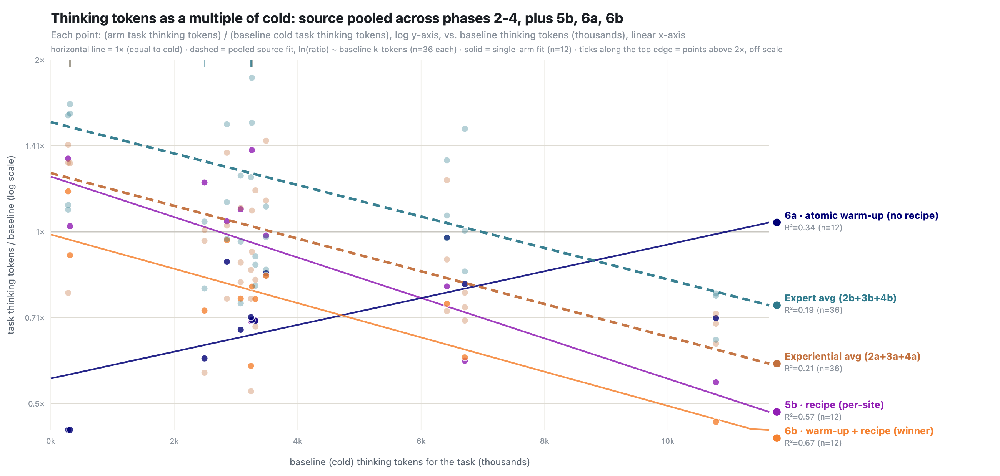

<em><b>Figure 17.</b> Each arm's own estimated total thinking tokens for a task divided by baseline (cold) thinking tokens for the same task, plotted against baseline thinking tokens in thousands (average of 1a/1b/1c). Horizontal line is 1&times; (equal to cold). Dashed = pooled source fit, ln(ratio) &#126; baseline k-tokens (experiential: 2a+3a+4a, expert: 2b+3b+4b, n=36 each); solid = single-arm fit (5b, 6a, 6b, n=12). Ticks along the top edge mark points above 2&times;, off scale. Built by <a href="../analysis/build_thinking_ratio_decay.py">build_thinking_ratio_decay.py</a> from <a href="../analysis/compute_thinking_per_task.py">compute_thinking_per_task.py</a>.</em>

From the multiplier analysis in Figure 17 you will notice that it has a similar profile as the wall-time latency but has a substantially more meaningful fit with a tighter R^2.

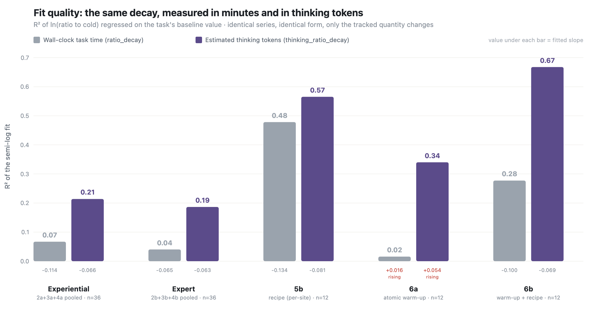

<em><b>Figure 18.</b> The same semi-log fit &mdash; ln(ratio to cold) regressed on the task's baseline value &mdash; run over wall-clock task time and over estimated thinking tokens, for the same five series. Only the tracked quantity changes, so the pair of bars is a like-for-like read on which one the trend actually describes: <b>thinking tokens fit better in every series</b>, and on the winning arm it is 0.67 against 0.28. The number under each bar is the fitted slope, red where it is positive (6a rises with task length rather than decaying, in both quantities). Built by <a href="../analysis/build_fit_quality.py">build_fit_quality.py</a>, which recomputes both fits from the same inputs as Figures 14 and 17.</em>

# Tying Them All Together
**The two key axes to pay attention to are turns and latency.**
Turns is selected over accuracy since it just represents a more granular measure of correctness.

<em><b>Figure 19.</b> Every arm placed by turns (path length) and end-to-end latency. The dashed crosshair marks the Phase-1 baseline, the average of the three baseline arms (1a, 1b, 1c); anything in the shaded lower-left beats it on both axes at once. The winning method, 6b, sits farthest into that corner.</em>

Figure 19 will serve to recap the key insights of the study. We will recap by phase which is in essence sequential steps of the study.

## Phase 1
|  |  |  |
|:---: | :---: | :---:|
| [`1a`](#1a-cinc-cinc-x-chrome) Official CinC &#183; Chrome &#183; setup-parity control | [`1b`](#1b-ocic-ch-ocic-x-chrome) OCIC &#183; Chrome &#183; cold | [`1c`](#1c-ocic-br-ocic-x-brave) OCIC &#183; Brave &#183; cold, the primary baseline |

The first phase showcased the parity of performance between Claude in Chrome and open-claude-in-chrome where the metrics scored as follows. 2.04 vs 1.95 min/task and 31.4 vs 32.6 turns, a 4% gap in either direction, **p=0.44 and p=0.67 on a paired permutation test**. Same accuracy. In short **the harnesses are interchangeable on outcome, they differ only in per-action overhead (0.31 s vs 0.12 s)**. ([`stats.py`](../analysis/stats.py), [`stats.json`](../analysis/stats.json))

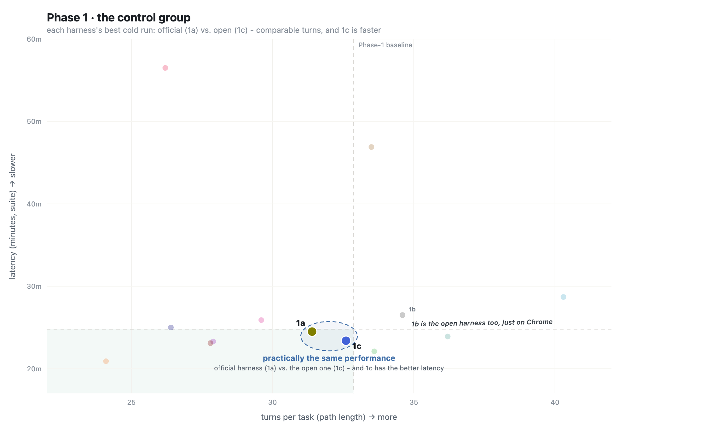

<em><b>Figure 20.</b> Same scalar-space plot as Figure 19 (all 13 arms, turns vs. latency); each harness's best cold run ringed: 1a (official CinC) and 1c (open harness on Brave, the primary baseline), with 1c ahead on latency. 1b, shown at reduced emphasis, is the open harness as well, on Chrome. All six phase-highlight plots are built by <a href="../analysis/build_phase_highlight.py">build_phase_highlight.py</a>.</em>

## Phase 2
|  |  |
|:---: | :---:|
| [`2a`](#2a-ocic-x-brave-x-experiential-workspace) Own past traces mounted on disk | [`2b`](#2b-ocic-x-brave-x-expert-workspace) Expert recordings mounted on disk |

For phase 2 I began to experiment with loading prior experience into the workspace.
**There was a heavy agentic search tax to internalize the content amounting for a 360% increase in non-browser tool calls for [2a](#2a-ocic-x-brave-x-experiential-workspace) and 289% for [2b](#2b-ocic-x-brave-x-expert-workspace).**
While in [2a](#2a-ocic-x-brave-x-experiential-workspace) the turn count would not be recovered, the latency did improve over the baseline.
On the other hand, while [2b](#2b-ocic-x-brave-x-expert-workspace) would not improve on latency nor turn count due to the new behavior, **it did increase in accuracy**.

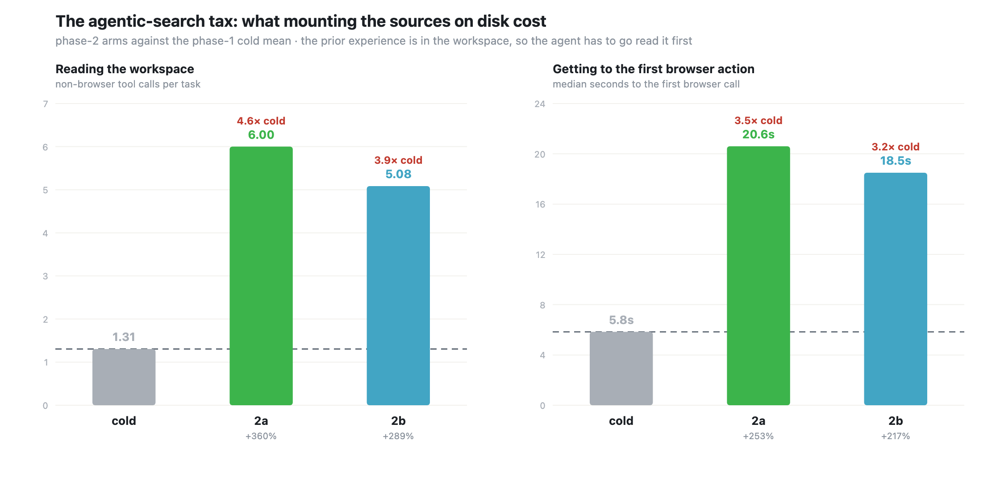

<em><b>Figure 21.</b> The search tax in the two places it lands. Left: non-browser tool calls per task, the reads and greps the agent spends on its own workspace before it does anything in the browser. Right: median seconds to the first browser call &mdash; <b>the agent takes 3.5&times; longer to touch the browser at all</b> (5.8s cold &rarr; 20.6s in 2a). Both are measured against the phase-1 cold mean, dashed. Built by <a href="../analysis/build_search_tax.py">build_search_tax.py</a> from <a href="../analysis/toolcalls.json">toolcalls.json</a> and the per-arm first-action medians.</em>

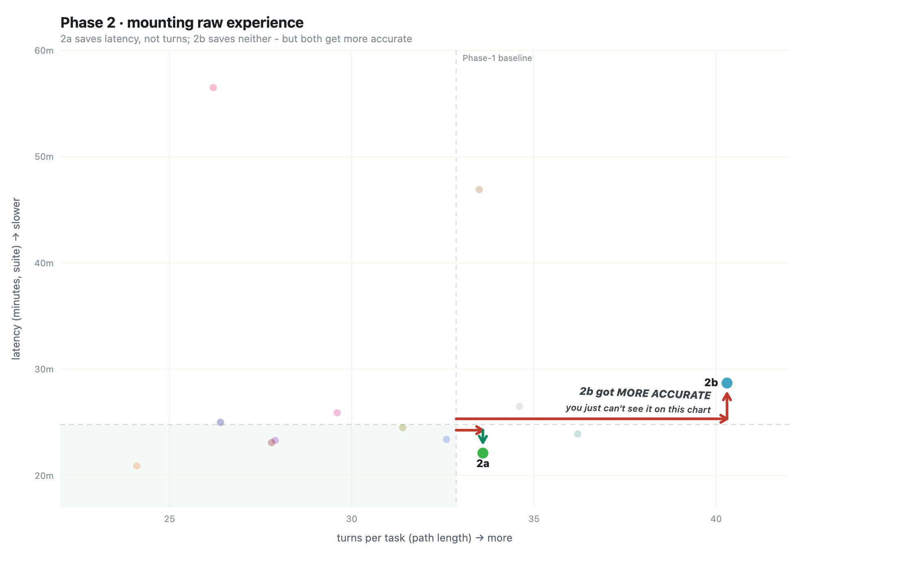

<em><b>Figure 22.</b> Same scalar-space plot; 2a/2b popped. 2b's accuracy improvement is real but isn't represented by either axis here.</em>

## Phase 3
|  |  |
|:---: | :---:|
| [`3a`](#3a-ocic-x-brave-x-experiential-workspace-x-analysis-docs) Compressed analysis of own runs, on disk | [`3b`](#3b-ocic-x-brave-x-expert-workspace-x-analysis-docs) Compressed analysis of expert recordings, on disk |

For phase 3 I attempted to reduce the agentic search tax by distilling the prior experience into a single analysis artifact present in the workspace.
**This resulted in a reduction in turn count between the arm and its phase 2 counterpart, -12% for [3a](#3a-ocic-x-brave-x-experiential-workspace-x-analysis-docs) and -10% for [3b](#3b-ocic-x-brave-x-expert-workspace-x-analysis-docs).**
**Yet surprisingly neither arm beat [2a](#2a-ocic-x-brave-x-experiential-workspace) on latency.**

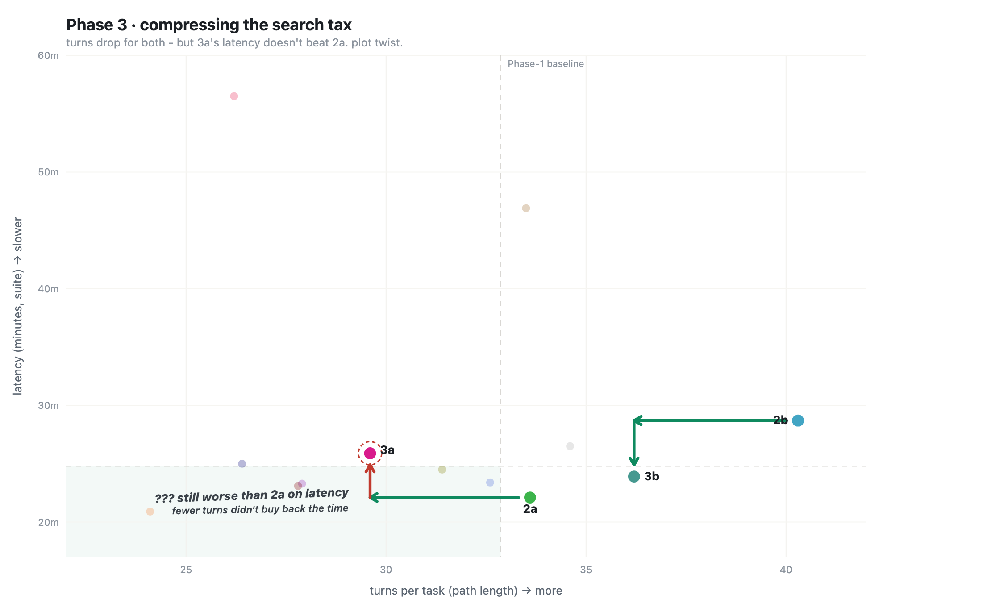

<em><b>Figure 23.</b> Same scalar-space plot; arrows track 2a&#8594;3a and 2b&#8594;3b. Turns drop for both moves; latency drops for 3b but not for 3a.</em>

## Phase 4
|  |  |
|:---: | :---:|
| [`4a`](#4a-ocic-x-brave-x-experiential-context) Own study session forked into context | [`4b`](#4b-ocic-x-brave-x-expert-context) Expert study session forked into context |

In phase 4 I decided to outright remove the dependency on the workspace and instead just internalize the priors into the context before the task.
**This resulted in an explosion in context reaching 480k tokens in [4a](#4a-ocic-x-brave-x-experiential-context) and 251k in [4b](#4b-ocic-x-brave-x-expert-context) resulting in a dramatic increase in seconds per turn 3.2x and 2x respectively.**
That being said there was an improvement in turn count, albeit not nearly enough to make up for the latency increase.

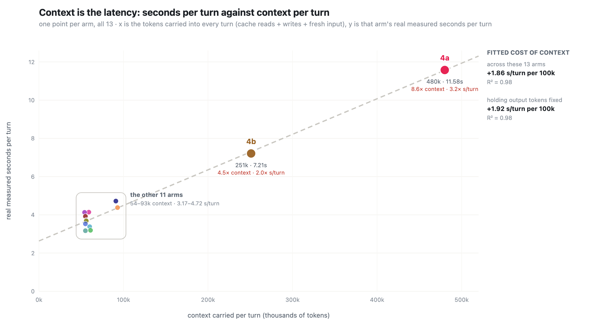

<em><b>Figure 24.</b> Every arm placed by the context it carries into each turn against its real measured seconds per turn. Eleven arms never leave a 54&ndash;93k / 3.2&ndash;4.7s cluster; 4a and 4b are the two that forked a whole prior session into the window. <b>The relation is close to linear and steep: +1.86 s per turn for every 100k of context across these 13 arms (R&#178;=0.98)</b>, matching the +1.92 s per 100k that the capstone's per-turn cost model gives when output tokens are held fixed &mdash; the same figure quoted under <a href="#context-load">Context Load</a>. Built by <a href="../analysis/build_context_latency.py">build_context_latency.py</a>.</em>

<em><b>Figure 25.</b> Same scalar-space plot; arrows track 3a&#8594;4a and 3b&#8594;4b. Nearly vertical: latency roughly doubles while turns move only slightly left.</em>

## Phase 5
|  |  |
|:---: | :---:|
| [`5a`](#5a-ocic-x-brave-x-single-analysis-embedded-task) One combined recipe in the prompt | [`5b`](#5b-ocic-x-brave-x-dynamic-analysis-embedded-task) Per-site recipe in the prompt |

In phase 5 I explored entirely stripping away the context and instead embedding a distillation of the priors into the task prompt.
Both saw an equal improvement over all prior arms.
The difference between the two was that [5a](#5a-ocic-x-brave-x-single-analysis-embedded-task) used a single recipe for both sites while [5b](#5b-ocic-x-brave-x-dynamic-analysis-embedded-task) dynamically passed one of two recipes based on the site.
**This distinction had no influence on outcomes.**

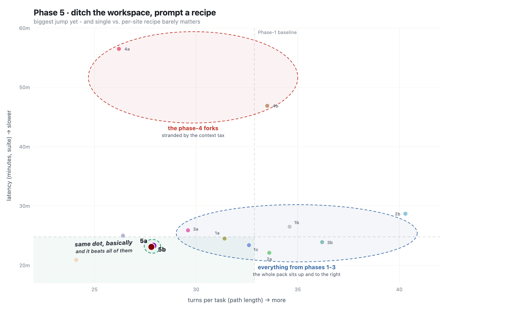

<em><b>Figure 26.</b> Same scalar-space plot; 5a/5b popped and ringed together (the two land close enough to be indistinguishable at this scale), with every prior arm shown mid-emphasis for context, grouped capstone-style: the phases-1-3 pack and the phase-4 forks.</em>

## Phase 6
|  |  |
|:---: | :---:|
| [`6a`](#6a-ocic-x-brave-x-single-experiential-context) Single-task warm-up fork, tiny context | [`6b`](#6b-ocic-x-brave-x-dynamic-analysis-embedded-task-x-single-experiential-context) Warm-up fork + site recipe |

Finally, in phase 6 I stubbornly wanted to know if any amount of warming up could outweigh the added context tax.
I ran [6a](#6a-ocic-x-brave-x-single-experiential-context) (just a single warm-up task) as a control and you could see that **it already captured nearly all of the turn savings of [4a](#4a-ocic-x-brave-x-experiential-context) at 98% while significantly improving accuracy at merely 19% of [4a](#4a-ocic-x-brave-x-experiential-context)'s context**.
Then I paired it with the embedded analysis artifact from [5b](#5b-ocic-x-brave-x-dynamic-analysis-embedded-task) to form [6b](#6b-ocic-x-brave-x-dynamic-analysis-embedded-task-x-single-experiential-context).
**[6b](#6b-ocic-x-brave-x-dynamic-analysis-embedded-task-x-single-experiential-context) then showcased a substantial improvement in both latency and turn count over [6a](#6a-ocic-x-brave-x-single-experiential-context): 20.9 vs 25.0 min (−16%) and 24.1 vs 26.4 turns (−9%) over [6a](#6a-ocic-x-brave-x-single-experiential-context).**

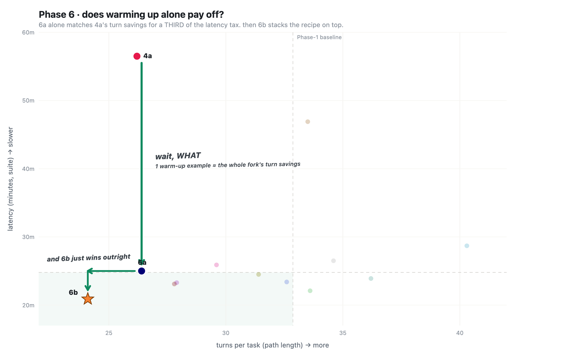

<em><b>Figure 27.</b> Same scalar-space plot; 4a&#8594;6a: turns barely move, latency collapses. 6a&#8594;6b: the recipe stacks on top and moves both axes further.</em>

## Phase 7 (Corroloary)
There was a lingering question during the study: how does [OCIC's methodology for recordings](../../README.md#imitation-learning-recording) (method that produces expert demonstrations) perform against [Anthropic's methedology for recordings](https://x.com/claudeai/status/2079595988998554047)?
To answer this question I produced an experiment that reproduced phase 3 and phase 5 line of methods but instead of comparing between experiential and expert demonstrations I compared between OCIC and Anthropic's recordings (expert demonstrations).
In this phase **both of the recordings happened over the same over the same demonstration simultaneously ensuring the same content was captured**.
The sources, the distilled artifacts and the exact authoring prompts are all preserved in [`benchmark/phase7_reproduction/`](../phase7_reproduction/README.md); **all four artifact sets were distilled by the same model at the same effort** ([`claude-fable-5`, max](../phase7_reproduction/distillation_prompts.md)), so the recording method is the only variable.

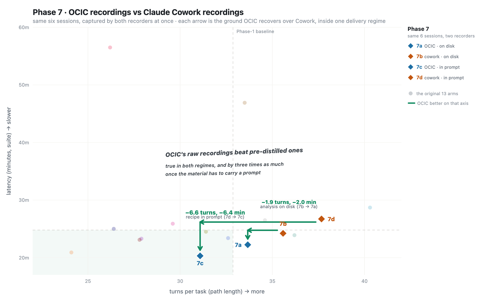

<em><b>Figure 28.</b> Same scalar-space plot; the four phase-7 arms (diamonds) over the original 13 (faded). Each arrow is the same comparison &mdash; Cowork &rarr; OCIC &mdash; inside one delivery regime, decomposed into its turns and latency components, so each vector is the ground OCIC recovers. Both components improve in both regimes, so every segment is green. The two vectors are directly comparable, and the second is roughly three times the first. Built by <a href="../analysis/build_phase7_highlight.py">build_phase7_highlight.py</a>.</em>

| Arm | Recording | Delivery | Suite | Turns/task | Passed |
| :--- | :--- | :--- | :---: | :---: | :---: |
| [7a](#7a-ocic-x-brave-x-ocic-expert-workspace-x-analysis-docs) | OCIC | analysis on disk | **22.2 min** | **33.7** | 12/12 |
| [7b](#7b-ocic-x-brave-x-claude-cowork-expert-workspace-x-analysis-docs) | Claude Cowork | analysis on disk | 24.2 min | 35.6 | 12/12 |
| [7c](#7c-ocic-x-brave-x-ocic-recordings-only-sourced-dynamic-analysis-embedded-task) | OCIC | recipe in prompt | **20.3 min** | **31.1** | 10/12 |
| [7d](#7d-ocic-x-brave-x-claude-cowork-recordings-only-sourced-dynamic-analysis-embedded-task) | Claude Cowork | recipe in prompt | 26.7 min | 37.7 | 8/12 |
| *baseline* | *&mdash;* | *cold ([1a](#1a-cinc-cinc-x-chrome)/1b/1c avg)* | *24.8 min* | *32.9* | *8/12* |

<em><b>Table 2.</b> The four phase-7 arms against the Phase-1 cold baseline. Suite is total run minutes over the 12 held-out tasks, turns is mean <code>num_turns</code> per task &mdash; the same definitions used for the other 13 arms throughout. Both recordings were captured over the same six demonstrations simultaneously, and both analysis artifacts were distilled by the same model under the same prompt, so the recording method is the only variable.</em>

**OCIC's recordings were demonstrably better than Anthropic's recordings on both latency and turn count.** OCIC's [7a](#7a-ocic-x-brave-x-ocic-expert-workspace-x-analysis-docs) was 2 minutes faster than Anthropic's [7b](#7b-ocic-x-brave-x-claude-cowork-expert-workspace-x-analysis-docs) on latency and 1.9 turns faster on turn count. For the dynamic analysis embedded task the margin significantly grew to now 6.4 turns faster for OCIC's [7c](#7c-ocic-x-brave-x-ocic-recordings-only-sourced-dynamic-analysis-embedded-task) than Anthropic's [7d](#7d-ocic-x-brave-x-claude-cowork-recordings-only-sourced-dynamic-analysis-embedded-task) and 6.6 turns faster.

# Conclusion

# Appendix
Here I really wanted to show this graphic (Figure 29) so I created an appendix just to show it.

<em><b>Figure 29.</b> Every arm (columns) against every held-out task (rows). Green = passed; amber = passed but slow for that arm (a within-arm time outlier, robust MAD z-score &gt; 1.5 against that arm's own task times, not a fixed time threshold); red F = failed. Accuracy is the deterministically re-graded verdict (see accuracy_regrade.py), not the raw LLM-judge output. dashdish-8 fails for every arm; zilloft-2, zilloft-5, and zilloft-10 are the three tasks whose verdict varies by arm. Built by <a href="../analysis/build_pass_slow_fail.py">build_pass_slow_fail.py</a>.</em>
